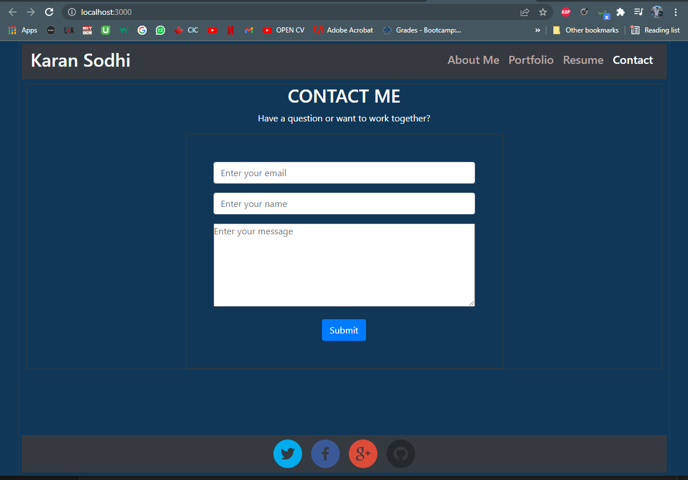
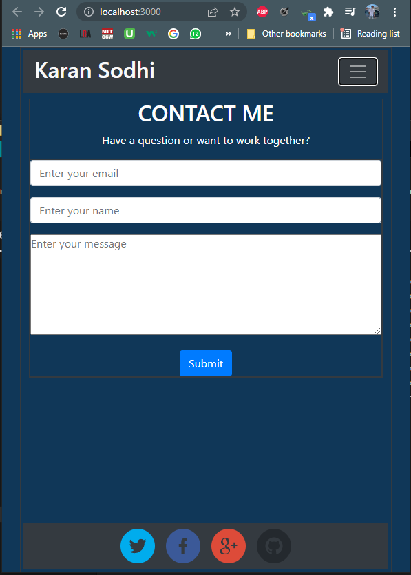
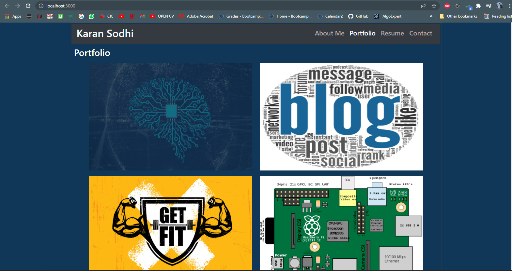

<h1 align='center'>Karan Sodhi Portfolio Using REACT</h1>
    
    <h2 id="description">Description</h2>
    
In this we replicated the challenge 2 where we created a basic portfolio app using HTML and CSS. However, in this app, we achieved the same thing but we used a library called 'REACT'. It is single paged application where all different components are mounted to a single root component inside of index.html. I created multiple components that were reused hence promoting DRY code. This is the basic functionality of REACT. We break down the app into several components and then we render them. It makes our app use less resources and inturn makes it more efficient and faster.

    

    <h2>Table of Contents</h2>
    <ul>
        <li><a href="#description">Description</a></li>
        <li><a href="#install">Installation</a></li>
        <li><a href="#usage">Usage</a></li>
        <li><a href="#license">License</a></li>
        <li><a href="#contri">Contributing</a></li>
        <li><a href="#test">Tests</a></li>
        <li><a href="#question">Questions</a></li>
    </ul>
    

    <h2 id="install">Installation</h2>
    
react react-bootstrap react-dom reac-social-icons

    

    <h2 id="usage">Usage</h2>
    
UofT Bootcamp

    

    <h2 id="license">License</h2>
    
    
MIT

    

    <h2 id="contri">Contributing</h2>
    
Karan Sodhi

    

    <h2 id="test">Tests</h2>
    
Unit

    

    <h2 id="question">Questions</h2>
    
Incase of questions, Find me on: 

    
 :<a href='mailto: karanpreetsodhi1997@gmail.com'>Email</a>

    
 :<a href='https://github.com/kkkaran'>Github</a>

